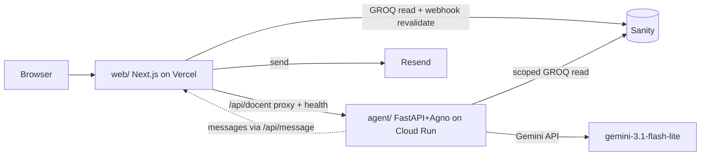

# Architecture Spine — ai-portfolio

## Design Paradigm

**Jamstack + sidecar agent service.** The site is statically generated content (Next.js SSG/ISR from Sanity) served from a CDN; the only always-on compute is a single decoupled sidecar (FastAPI + Agno on Cloud Run) that the site talks to over HTTP and can live entirely without. Layer map:

- `web/` — Next.js app: pages, API routes (contact + docent proxy), all UI
- `agent/` — Python sidecar: Agno docent, its Sanity retrieval, nothing else
- Sanity (hosted) — the single content source; no content lives in code
- Vercel serves `web/`; Cloud Run serves `agent/`; they never share a runtime

## Invariants & Rules

### AD-1 — Sanity is the sole content source [ADOPTED]

- **Binds:** all
- **Prevents:** content forked between page copy, agent knowledge, and hardcoded strings — the "stale site" failure the whole project exists to prevent
- **Rule:** Every fact a visitor can read — works, talks, papers, stats, story, timeline, docent answers — resolves from Sanity. "Microcopy in code" means non-content UI labels only (button text, form labels, aria strings); anything a visitor would read as *about Rohan* is content. Stats are derived by counting Sanity documents, never manually maintained numbers (see AD-11).

### AD-2 — The site never depends on the agent

- **Binds:** web/, agent/
- **Prevents:** coupling site uptime to agent uptime; broken docent affordances (spec Frame 6: "fully excellent with the agent off")
- **Rule:** `web/` may call `agent/` only through one health-checked HTTP client. `/health` is liveness-only; probed once per session on first page load, one retry after 5s. Every docent UI element renders only after a successful probe (a late-appearing launcher on cold start is accepted behavior). No build-time or import-time dependency in either direction. The agent never calls the site's pages.

### AD-3 — Static-first rendering [ADOPTED via <1s paint rule]

- **Binds:** web/
- **Prevents:** pages that need a warm server (or hydration) to show content, breaking the 15-second-proof rule on mid-range mobile
- **Rule:** Every page is SSG/ISR; content is in the HTML payload. Client JS is progressive enhancement only (count-ups, filters, docent). Sanity publish → webhook → ISR revalidation is the only content-update path (no redeploy needed).

### AD-4 — One message pipeline, email as system of record

- **Binds:** web/ (API route), agent/
- **Prevents:** two inboxes, an unowned message store, divergent auto-ack behavior between form and docent
- **Rule:** All inbound messages (contact form, docent message-taking) POST to the single `web/` API route `/api/message` (envelope and per-source validation: AD-8) and are sent via Resend: notification to rohanyashraj@gmail.com + auto-acknowledgement to sender. The agent never sends email directly; it forwards captured messages to `/api/message`. No message database.

### AD-5 — Docent answers only from Sanity, retrieved live

- **Binds:** agent/
- **Prevents:** a duplicated knowledge base (vector store, embedded docs) that goes stale on CMS edits; hallucinated claims
- **Rule:** The agent's only knowledge tool is scoped GROQ queries against the same public Sanity dataset the site reads, **published perspective only** (drafts are invisible to both consumers — AD-10). Out-of-scope questions get the honest-miss response (spec Frame 3), never an open-web or training-data answer. Model: `gemini-3.1-flash-lite` (GA id only).

### AD-6 — Legacy URLs are mapped, never dead

- **Binds:** web/
- **Prevents:** generic 404s confirming the staleness fear; SEO loss from the old site
- **Rule:** Every URL of rohanyashraj.github.io gets a 301 in `next.config` redirects at cutover. The 404 page renders only for unmapped paths, in gallery voice, with threshold-gated fuzzy suggestion. Recurring unknown 404 paths feed back into the redirect map.

### AD-7 — Secrets and keys stay server-side

- **Binds:** web/, agent/
- **Prevents:** Gemini/Resend/Sanity-write keys leaking into the static bundle
- **Rule:** The browser holds zero secrets. Docent calls go browser → `web/` `/api/docent` proxy → Cloud Run (authenticated by shared secret header); Resend and any Sanity write token live only in server env. Public Sanity reads use the public dataset CDN.

### AD-8 — One message envelope, per-source validation

- **Binds:** web/app/api/message, agent/
- **Prevents:** the route's two producers (form, agent) building incompatible payloads; the route being publicly forgeable as "docent-sourced"
- **Rule:** `/api/message` accepts exactly `{ source: 'form' | 'docent', name, email?, regarding?, message }`. Form-sourced posts pass honeypot + IP rate limit; docent-sourced posts must carry the shared-secret header (same secret as `/api/docent` → Cloud Run) and are rejected without it.

### AD-9 — Sanity owns every docent-visible string

- **Binds:** web/ (DocentPanel, launcher), agent/ (system prompt assembly)
- **Prevents:** three letter-compliant owners of the docent's voice (web hardcode, agent prompt, CMS) drifting apart
- **Rule:** Greeting templates, suggested-tap chips (per room), honest-miss copy, panel subtitle, and the response-time promise live in a `docentSettings` singleton in Sanity. `web/` renders them; `agent/` receives them as prompt context. Neither hardcodes them.

### AD-10 — The studio schema is the content-shape contract

- **Binds:** studio/, web/, agent/
- **Prevents:** a schema rename silently breaking the agent (AD-5's honest-miss would mask it) or the site; drafts leaking to one consumer but not the other
- **Rule:** `studio/` schemas are the single contract for content shape. Slugs are immutable after publish (changing one is a redirect-map event, AD-6). Both consumers read the published perspective only. A schema field rename/removal is a breaking change and must be checked against both `web/` queries and `agent/` retrieval before deploy.

### AD-11 — Derived stats have one query definition

- **Binds:** web/, agent/
- **Prevents:** hero stats and docent-quoted stats computed by two different counts (e.g. one includes drafts or co-authored items, one doesn't)
- **Rule:** The GROQ count queries behind years/papers/talks are defined once (exported from `studio/` alongside the schema contract) and imported by both consumers. Neither writes its own stat query.

### AD-12 — Docent transport: SSE end-to-end, client-owned history

- **Binds:** web/app/api/docent, web/ DocentPanel, agent/
- **Prevents:** a buffering proxy vs a streaming panel (both letter-compliant); conversation state acquiring a server-side owner that contradicts the no-database stance
- **Rule:** `/chat` streams SSE; the `web/` proxy uses a streaming route handler and never buffers the response. Conversation history lives only in the client (per-visit, per spec); each request carries the history; the agent is stateless per request. Both public API routes (`/api/docent`, `/api/message`) are rate-limited at the `web/` layer.

### Dependency direction



`web/` and `agent/` both read Sanity; only `web/` sends email; the agent is reachable only through the `web/` proxy.

## Consistency Conventions

| Concern | Convention |
| --- | --- |
| Naming | Sanity types singular camelCase (`work`, `talk` and `paper` as kinds, `siteSettings`); Next.js routes kebab-case matching spec slugs (`/`, `/archive`, `/archive/[slug]`, `/speaking`, `/about`, `/contact`); components PascalCase matching design-system names (PlacardCard, DocentPanel…) |
| Content model | One `work` document type with a `kind` field (`project · paper · talk`) and type-specific field groups — mirrors the "one template, three types" contract of spec 2.2; `headlineResult` required for publish |
| Data & formats | Dates ISO-8601 in data, rendered per design system (year-first placards); API routes return `{ ok: boolean, error?: string }`; slugs are the shared key between pages, redirects, and docent pointers |
| State & cross-cutting | No client state library — URL params (`?type=`, `?intent=`) and React state only; design tokens live in one CSS-custom-properties file matching `D-Design-System/00-design-system.md`; theme via `data-theme` attribute; `prefers-reduced-motion` honored in every animation |
| Errors & logging | Agent failures degrade silently in UI (hide launcher) but log loudly (Cloud Run + Vercel logs); message-send failures always surface the email fallback |

## Stack

| Name | Version |
| --- | --- |
| Next.js | 16.2.x LTS |
| React | (bundled with Next.js 16) |
| Sanity | hosted; `next-sanity` **^13** (required for Next 16); **no SanityLive** — webhook→ISR only |
| Python | 3.12+ |
| Agno | 2.6.x |
| FastAPI | current stable |
| Gemini | `gemini-3.1-flash-lite` (GA) |
| Resend | current SDK |
| Hosting | Vercel (web, free tier) · Google Cloud Run (agent, free tier, min-instances=0) |

## Structural Seed

```text
ai-portfolio/
  web/                      # Next.js — everything the visitor sees
    app/                    #   routes per spec slugs; api/message + api/docent
    components/             #   design-system components (PascalCase)
    lib/                    #   sanity client, agent client (the ONE health-checked client)
    styles/                 #   tokens.css from D-Design-System
  agent/                    # FastAPI + Agno sidecar — docent only
    app.py                  #   /chat (SSE), /health
    knowledge.py            #   scoped GROQ retrieval tools
  studio/                   # Sanity Studio (schemas = content contract)
  design-artifacts/         # WDS specs (authoritative for UX)
```

Deployment: push to `main` → Vercel builds `web/`; Cloud Run deploys `agent/` from its Dockerfile (GitHub integration). Sanity Studio hosted via `sanity deploy`. Environments: production + Vercel preview deploys only (no staging tier at this scale). The site's docent health probe on page load doubles as the Cloud Run warm-up call (min-instances=0 cold-start mitigation).

## Capability → Architecture Map

| Capability / Area | Lives in | Governed by |
| --- | --- | --- |
| 9 pages/views (specs 1.1–4.1) | web/app | AD-3, conventions |
| Count-up stats | web/ (derived counts) | AD-1, AD-11 |
| Contact + docent messages | web/app/api/message | AD-4, AD-7, AD-8 |
| Docent conversation (6 frames) | agent/ + web DocentPanel | AD-2, AD-5, AD-7, AD-9, AD-12 |
| Legacy URL survival | web/next.config redirects + 404 | AD-6 |
| <15-min content updates | Sanity → webhook → ISR | AD-1, AD-3, AD-10 |

## Deferred

- **Analytics choice** (docent 30% engagement metric needs one) — pick at build; Vercel Analytics or Plausible both fit; nothing structural depends on it
- **Vector retrieval for the docent** — revisit only if GROQ-scoped retrieval proves insufficient at real content volume (AD-5 stands until then)
- **Speaker one-pager PDF & Archive free-text search** — backlogged features; no architectural footprint now
- **Notes/blog wing** — deferred by brief until content exists; the `work` content model does not pre-provision it
- **Staging environment / CI test gates** — solo project; Vercel previews cover it until a second contributor appears
- **Uptime monitoring for the agent** — AD-2 hides failures from visitors, so they're invisible to the owner too; add a free ping monitor (e.g. UptimeRobot on `/health`) at launch
- **DNS cutover runbook** — enumerate legacy URLs → 301 map → switch DNS; write at launch, not now
- **Sanity draft-preview workflow** — published-only reads (AD-10) make previews a Studio-side concern; adopt Sanity's presentation tool only if drafting friction appears
