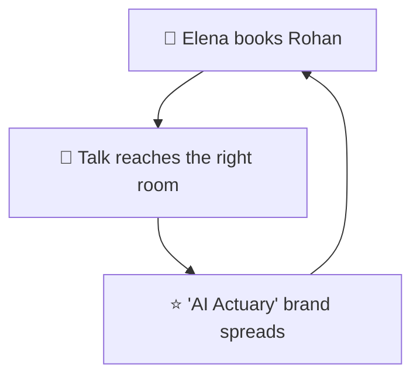

# Elena the Event Curator - Primary Persona

> ⭐ PRIMARY target — every talk she books amplifies the "AI Actuary" brand and feeds the flywheel

**Priority:** PRIMARY 🎤
**Role in Flywheel:** THE ENGINE's accelerator — speaking engagements spread the positioning to rooms full of exactly the right people
**Created:** 2026-07-12

---

## Profile Summary

**Elena curates content for insurance-industry and applied-AI conferences. She has three slots left, forty names on her list, and one afternoon to shortlist.** She doesn't need convincing that AI×actuarial is a hot topic — she needs certainty that the person she books actually knows both sides and won't bore or embarrass her audience. When she lands on rohanyashraj.com, she's not browsing; she's vetting. If the site answers her three questions in three minutes, Rohan makes the shortlist.

She matters most because a single booked talk multiplies: audience members become recruiters' referrals, peers' citations, and next year's invitations.

## Visual Representation

**Image Generation Prompt:**
"Professional photograph of a 41-year-old European woman, conference program director, short dark hair, standing in a modern conference venue lobby with a tablet, focused and evaluative expression, business attire, soft natural lighting, shallow depth of field, photorealistic, 4K"

---

## Background

### Business Journey

**Company Role:** Head of Programming at a mid-size insurance/InsurTech conference series; also advises an actuarial society's CPD events.

**Experience Level:** 12+ years in events; has seen every flavor of "AI expert" since 2023.

**Technical Background:** Not technical herself — relies on proxies: credentials, past stages, published work, peer endorsement.

**Management Style:** Decisive, checklist-driven, protective of her audience's time and her event's reputation.

---

## Current Situation

### Professional Reality

**The Daily Struggle:**
- Dozens of speaker pitches, most recycled and generic
- "AI" claims everywhere; verifiable AI+domain depth almost nowhere
- Zero time to watch full talk recordings for every candidate
- Her reputation rides on every name she puts on stage

**Skills & Tools:**
- LinkedIn, Google, speaker bureaus, peer recommendations
- Skims a personal site in 2–3 minutes max
- Screenshots credibility signals to share with her committee

**The Vetting Gap:**
- She can't judge actuarial-AI depth herself — she needs the site to make credibility self-evident
- What's blocking her: sites that bury credentials, list stale content, or offer no evidence of stage presence
- What she needs: proof, past talks, and a one-tap invite path

---

## Psychological Profile

### Personality & Motivations

**Core Identity:**
- Audience-first curator — a bad speaker is a personal failure
- Pattern-matcher: she's fast because she's seen a thousand speaker pages
- Deeply values original, recent work over recycled keynote circuit content
- Believes the program IS the product

**Work Style:**
- Decides fast, verifies faster
- Trusts artifacts (papers, talk listings, credentials) over adjectives
- Prefers written outreach; hates phone tag

---

## Driving Forces

### ✅ Top 3 Positive Drivers (What She Wants)

**1. Instantly verify AI×actuarial credibility**
- She needs "FIA, FIAI × data scientist" confirmed in seconds, backed by real work
- It matters because she can't technically vet the content herself
- Success: she screenshots the Entrance + Selected Works for her committee
- **Gallery Promise:** The Entrance states the niche line <1s; Selected Works shows dated, real artifacts before any words about them

**2. Evidence he can hold a room**
- Past conference presentations with context — where, to whom, on what
- It matters because expertise ≠ stage presence
- Success: she finds three prior talks in one tap and one looks just like her event
- **Gallery Promise:** The Speaking & Writing room lists presentations with event context, kept current by the CMS

**3. A frictionless invite path**
- A visible, purpose-built way to start a speaking conversation
- It matters because friction at the invite moment loses busy curators
- Success: invitation sent in under two minutes, acknowledged promptly
- **Gallery Promise:** A quiet "Invite Rohan to speak" path in Speaking & Writing, plus The Study's form and the docent as message-taker

### ❌ Top 3 Negative Drivers (What She Fears)

**1. Booking a hype merchant**
- Someone who claims AI fluency but can't go beyond buzzwords on stage
- Terrifying because her audience and reputation pay the price
- Failure: visible audience disengagement, committee blowback
- **Gallery Answer:** The site demonstrates rather than claims — the working Agno docent is the first exhibit; skills appear only inside real work; no buzzword bio

**2. Wasting an afternoon digging for credentials**
- Hunting through a vague site for proof that should be front and center
- Failure: she gives up and books the next name on the list
- **Gallery Answer:** 15-second proof rule — credentials at the Entrance, highlights first, Archive filterable one tap deep

**3. Unresponsive or dead contact channels**
- Sending an invite into the void
- Failure: no reply before her deadline; slot goes elsewhere
- **Gallery Answer:** Contact form with reliable delivery (honeypot antispam), docent fallback to email, and no dead sections anywhere to suggest abandonment

---

## Transformation Journey

**Before:** Skeptical scanner with a list of forty names and no time.
**During:** Three minutes in the gallery — Entrance confirms the niche, Selected Works proves the work, Speaking & Writing proves the stage, docent answers her one specific question.
**After:** Convinced advocate — she books the talk, and pitches "the AI Actuary" to her committee using the site's own framing.

## Strategic Triangle

## Impact on Business Goals

- ⭐ PRIMARY: each talk is a backlink, a citation, an audience — search ownership compounds
- 🚀 SECONDARY: speaking inquiries are the highest-leverage conversion
- 🌟 TERTIARY: talk recordings/slides become new Archive exhibits via the CMS

---

## Related Documents

- **[trigger-map.md](../trigger-map.md)** — Visual overview
- **[03-Rahul-the-Recruiting-Lead.md](03-Rahul-the-Recruiting-Lead.md)** — Secondary persona
- **[04-Ananya-the-Aspiring-AI-Actuary.md](04-Ananya-the-Aspiring-AI-Actuary.md)** — Tertiary persona
- **[feature-impact-analysis.md](../feature-impact-analysis.md)** — Feature prioritization

_Back to [Trigger Map](../trigger-map.md)_
