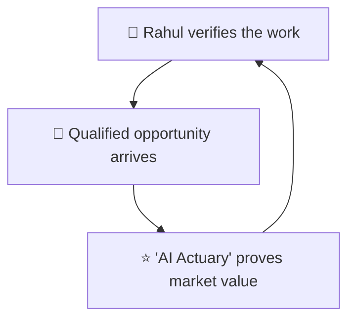

# Rahul the Recruiting Lead - Secondary Persona

> 🚀 SECONDARY target — converts the niche directly into career and consulting opportunities

**Priority:** SECONDARY 💼
**Role in Flywheel:** Driven by the engine — arrives already primed by the "AI Actuary" positioning; the site's proof closes the deal
**Created:** 2026-07-12

---

## Profile Summary

**Rahul fills senior actuarial data-science and AI leadership roles — sometimes as an in-house hiring manager, sometimes scouting consulting talent for insurers.** He gives a portfolio under a minute before deciding whether it earns three more. Résumés all read the same to him now; what he hunts for is shipped work, evidence of judgment, and a signal that the person is still growing. He's allergic to template portfolios and buzzword bios — they read as commodity candidates.

He matters because career and consulting opportunities are the brief's explicit goal, and he is the person who brings them.

## Visual Representation

**Image Generation Prompt:**
"Professional photograph of a 38-year-old Indian man, talent acquisition director, at a standing desk with dual monitors reviewing candidate profiles, sharp assessing expression, smart casual attire, modern office, natural window light, photorealistic, 4K"

---

## Background

### Business Journey

**Company Role:** Director of Talent / hiring manager for quantitative & AI roles at a global insurer; previously an executive-search consultant.

**Experience Level:** 10+ years hiring quants; screens hundreds of profiles a quarter.

**Technical Background:** Semi-technical — can read a case study critically, knows enough to spot hand-waving.

**Management Style:** Efficient, evidence-driven, moves fast on rare profiles.

---

## Current Situation

### Professional Reality

**The Daily Struggle:**
- Everyone's LinkedIn now says "AI"; differentiation is near zero
- Genuine actuarial+AI hybrids are extremely rare — and extremely in demand
- 55 seconds per portfolio; 80% of his peers spend under three minutes
- False positives are expensive: a bad senior hire costs a year

**Skills & Tools:**
- LinkedIn Recruiter, GitHub, Google, personal sites
- Skims for artifacts: real projects, publications, credentials
- Forwards strong profiles internally — the site becomes the pitch

**The Verification Gap:**
- He needs to distinguish "did the work" from "watched the webinar"
- What's blocking him: portfolios that are all adjectives, skill-logo walls, stale content
- What he needs: best work first, process and results one tap deep, currency signals

---

## Psychological Profile

### Personality & Motivations

**Core Identity:**
- Proof-seeker — believes artifacts over adjectives
- Prides himself on spotting rare hybrid talent early
- Values candidates who communicate clearly — the portfolio IS a communication sample
- Believes how a person presents their work predicts how they'll present to stakeholders

**Work Style:**
- Scans first, reads second, contacts fast when convinced
- Judges polish as a proxy for professionalism
- Prefers a specific, low-friction contact route

---

## Driving Forces

### ✅ Top 3 Positive Drivers (What He Wants)

**1. Proof of real shipped work in 15 seconds**
- Best, most relevant work visible immediately — not everything ever done
- It matters because his first pass is under a minute
- Success: within one screen he thinks "this one's different"
- **Gallery Promise:** Selected Works leads — few pieces, big space, placard captions; work before words; content visible <1s

**2. Depth on process & results one tap away**
- When intrigued, he wants the how and the outcome, not just the what
- It matters because process reveals judgment — the thing he's actually hiring
- Success: a case in the Archive answers his "but how?" question
- **Gallery Promise:** The Archive holds full project/paper/talk detail, filterable, one tap from any highlight

**3. Signal that Rohan is current, not coasting**
- Recent dates, recent talks, a live working AI agent
- It matters because AI talent decays fast; currency is the differentiator
- Success: the newest exhibit is weeks old, and the docent works flawlessly
- **Gallery Promise:** CMS-fed highlights stay fresh; the docent is a living demo; no dead sections rule

### ❌ Top 3 Negative Drivers (What He Fears)

**1. Template portfolio = commodity candidate**
- Another Bootstrap/Notion clone signals nothing distinctive
- Terrifying because presenting a commodity profile internally hurts his credibility
- Failure: he closes the tab in ten seconds
- **Gallery Answer:** The gallery-retrospective concept is deliberately non-template — distinctive aesthetic, magazine typography, unmistakably a portfolio

**2. Buzzwords without artifacts**
- "Passionate about leveraging AI" with no evidence
- Failure: profile discarded as noise
- **Gallery Answer:** Anti-goals enforced — no skill-logo walls, no buzzword bio; skills appear only inside work; the docent answers only from real CMS content

**3. A stale, abandoned site**
- Last update 2023 → is this person even active?
- Failure: doubt kills the outreach impulse
- **Gallery Answer:** Effortless CMS updates (<15 min) keep everything current; deferred "Notes" wing ships only when content exists

---

## Transformation Journey

**Before:** Skeptical screener with 40 tabs open.
**During:** 55 seconds → hooked by Selected Works; 3 minutes → convinced by an Archive case; asks the docent one probing question and gets a grounded answer.
**After:** Reaches out via The Study — and forwards the site internally as the pitch itself.

## Strategic Triangle

## Impact on Business Goals

- 🚀 SECONDARY: he IS objective 2 — consulting & career inquiries
- ⭐ PRIMARY: strong candidates get googled — his searches reinforce "AI Actuary" ownership
- 🌟 TERTIARY: his outreach validates that the living gallery converts

---

## Related Documents

- **[trigger-map.md](../trigger-map.md)** — Visual overview
- **[02-Elena-the-Event-Curator.md](02-Elena-the-Event-Curator.md)** — Primary persona
- **[04-Ananya-the-Aspiring-AI-Actuary.md](04-Ananya-the-Aspiring-AI-Actuary.md)** — Tertiary persona
- **[feature-impact-analysis.md](../feature-impact-analysis.md)** — Feature prioritization

_Back to [Trigger Map](../trigger-map.md)_
