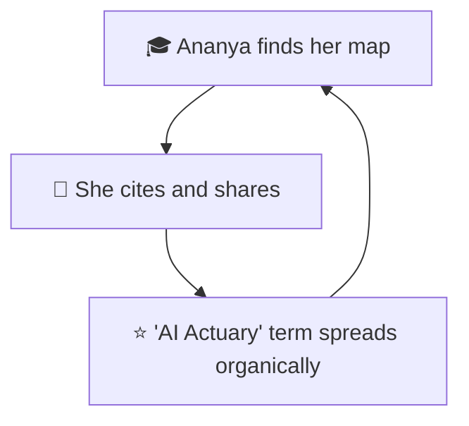

# Ananya the Aspiring AI Actuary - Tertiary Persona

> 🌟 TERTIARY target — the community that amplifies the "AI Actuary" term through citations, shares, and follows

**Priority:** TERTIARY 🎓
**Role in Flywheel:** Community amplification — every student who cites a paper or shares a talk strengthens search ownership of the niche
**Created:** 2026-07-12

---

## Profile Summary

**Ananya is an actuarial student two exams from qualification, watching AI reshape her profession and wondering whether it's a threat or her biggest opening.** She found Rohan through a conference talk shared on LinkedIn. She's not bringing an opportunity — she's looking for a map: proof that the actuary→AI path exists, is walkable, and has been walked by someone with the same credentials she's earning.

She matters because peers and students are who make "AI Actuary" a term rather than a tagline — they cite, share, and search it into existence.

## Visual Representation

**Image Generation Prompt:**
"Natural photograph of a 25-year-old Indian woman, actuarial analyst, studying at a desk with laptop and exam materials, curious and hopeful expression, casual professional attire, warm evening lamp light, photorealistic, 4K"

---

## Background

### Education & Career Path

**University/School:** Statistics degree; pursuing IFoA/IAI actuarial exams while working.

**Learning Journey:** Excel → R → Python; self-teaching ML through online courses on evenings and weekends.

**First Break:** Analyst role at an insurer's pricing team.

**Current Role:** Actuarial analyst, quietly building side projects.

**Career Pattern:** Traditional actuarial track, hunting for the on-ramp to AI before the profession decides for her.

---

## Current Situation

### Professional Reality

**The Daily Struggle:**
- Exam grind leaves little energy; AI feels like a second full-time curriculum
- Seniors dismiss AI; tech people dismiss actuaries — she's between camps
- Plenty of AI hype content, almost no credible actuary-specific guidance
- Imposter syndrome in both directions

**Skills & Tools:**
- Solid statistics, growing Python, basic ML
- LinkedIn, actuarial forums, conference recordings
- Saves and shares resources with her study circle

**The Role-Model Gap:**
- She needs existence proof: a qualified actuary (FIA, FIAI) who genuinely does AI
- What's blocking her: no visible, credible template for the hybrid career
- What she needs: an accessible body of work showing the path step by step

---

## Psychological Profile

### Personality & Motivations

**Core Identity:**
- Diligent, ambitious, quietly worried about relevance
- Learns from examples, not exhortations
- Values credentials — they're what she's sacrificing her twenties for
- Believes the hybrid path is real but needs to see it

**Life Approach:**
- Studies systematically; bookmarks obsessively
- Shares generously within her community
- Reaches out rarely — only when it feels welcome

---

## Driving Forces

### ✅ Top 3 Positive Drivers (What She Wants)

**1. A visible actuary→AI career path**
- A concrete narrative from exams to AI practice, with credentials intact
- It matters because existence proof turns anxiety into a plan
- Success: she can retell Rohan's path as her own roadmap
- **Gallery Promise:** About the Artist tells the actuary→AI story in one human paragraph; the Entrance anchors "actuary (FIA, FIAI) × data scientist"

**2. Accessible papers & talks to learn from**
- Real research and presentations she can actually study
- It matters because actuary-specific AI material is scarce
- Success: three Archive items land in her study group's chat
- **Gallery Promise:** The Archive is open, filterable, one tap deep — projects, papers, and talks with context

**3. A way to connect**
- A non-intimidating channel to ask one question or say thanks
- It matters because mentorship moments compound careers
- Success: she sends a message and gets a human reply
- **Gallery Promise:** The docent welcomes questions and takes messages; The Study's form is open to non-transactional mail

### ❌ Top 3 Negative Drivers (What She Fears)

**1. Hype without substance**
- Another "AI thought leader" whose depth ends at the headline
- Terrifying because betting her career prep on hype wastes years
- Failure: follows the wrong model, learns the wrong things
- **Gallery Answer:** Everything is demonstrated — dated work, real publications, a working agent; skills only inside work

**2. Gatekept, inaccessible content**
- Paywalls, jargon walls, or content pitched only at executives
- Failure: she bounces, learns nothing, shares nothing
- **Gallery Answer:** Open Archive, plain-language placard captions, docent explanations at whatever level she asks

**3. Feeling the path is unreachable**
- If the story reads as genius-only, it discourages rather than guides
- Failure: admiration without action — no amplification, no follow
- **Gallery Answer:** One human story, one portrait, no pedestal — the gallery shows craft built exhibit by exhibit

---

## Transformation Journey

**Before:** Anxious exam-taker unsure the hybrid career exists.
**During:** Finds the map — story in Room 3, learnable work in Room 4, a welcoming docent.
**After:** Inspired follower who cites the papers, shares the talks, and tells her study group about "the AI Actuary."

## Strategic Triangle

## Impact on Business Goals

- 🌟 TERTIARY: she is the community the living gallery serves — and objective 5's metric
- ⭐ PRIMARY: her searches, shares, and citations build organic ownership of the term
- 🚀 SECONDARY: today's student is tomorrow's organizer or hiring manager

---

## Related Documents

- **[trigger-map.md](../trigger-map.md)** — Visual overview
- **[02-Elena-the-Event-Curator.md](02-Elena-the-Event-Curator.md)** — Primary persona
- **[03-Rahul-the-Recruiting-Lead.md](03-Rahul-the-Recruiting-Lead.md)** — Secondary persona
- **[feature-impact-analysis.md](../feature-impact-analysis.md)** — Feature prioritization

_Back to [Trigger Map](../trigger-map.md)_
