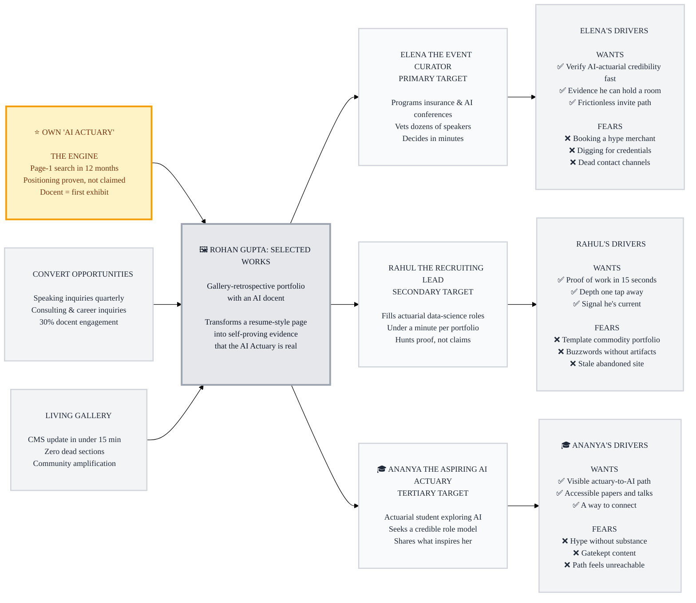

# Trigger Map: ai-portfolio

> Visual overview connecting business goals to visitor psychology for rohanyashraj.com — "Rohan Gupta: Selected Works"

**Created:** 2026-07-12
**Author:** Rohan (facilitated by Saga, Dream mode)
**Methodology:** Effect Mapping (Balic & Domingues), adapted for WDS with negative driving forces

---

## Strategic Documents

- **[personas/02-Elena-the-Event-Curator.md](personas/02-Elena-the-Event-Curator.md)** — ⭐ Primary persona
- **[personas/03-Rahul-the-Recruiting-Lead.md](personas/03-Rahul-the-Recruiting-Lead.md)** — 🚀 Secondary persona
- **[personas/04-Ananya-the-Aspiring-AI-Actuary.md](personas/04-Ananya-the-Aspiring-AI-Actuary.md)** — 🌟 Tertiary persona
- **[feature-impact-analysis.md](feature-impact-analysis.md)** — Prioritized features with impact scores

---

## Vision

**"AI Actuary" searches to Rohan.** The site doesn't claim AI fluency — it demonstrates it: the docent agent is the first exhibit, and every room proves competence within 15 seconds to time-poor evaluators who arrive with an opportunity in hand.

---

## Business Objectives

### ⭐ PRIMARY GOAL: Own the "AI Actuary" Niche (THE ENGINE)
- **Statement:** rohanyashraj.com becomes the definitive proof of the "AI Actuary" positioning — demonstrated, not claimed
- **Metric:** Search ranking for "AI Actuary"; visitors who can state the positioning after 15 seconds
- **Target:** Page-1 ranking for "AI Actuary" within 12 months; niche line visible <1s on any device
- **Timeline:** 12 months
- **Impact:** This drives ALL other objectives — the niche is what makes invitations and offers arrive

### 🚀 SECONDARY: Convert Visits into Opportunities (Driven by the Niche)

**Objective 1: Speaking invitations**
- **Statement:** The "Invite Rohan to speak" path converts organizers who arrive vetting
- **Metric:** Speaking inquiries via The Study / docent
- **Target:** 1+ qualified speaking inquiry per quarter
- **Timeline:** 6 months from launch

**Objective 2: Consulting & career inquiries**
- **Statement:** Recruiters and consulting leads verify competence and reach out
- **Metric:** Contact-form + docent-message inquiries
- **Target:** 2+ qualified inquiries per quarter
- **Timeline:** 6 months from launch

**Objective 3: Docent as standalone case study**
- **Statement:** The Agno docent is itself citable proof of AI fluency
- **Metric:** Docent engagement rate; docent mentioned in inbound messages
- **Target:** 30% of visitors interact with the docent
- **Timeline:** 3 months from launch

### 🌟 TERTIARY: A Living Gallery (Benefits for Rohan & His Community)

**Objective 4: Effortless updatability**
- **Statement:** One CMS update refreshes both pages and docent knowledge
- **Metric:** Time from new talk/paper to live on site
- **Target:** <15 minutes per update; zero dead sections, ever
- **Timeline:** From launch
- **Benefit:** The site stays current, so the niche claim never decays

**Objective 5: Guide the next AI actuaries**
- **Statement:** Peers and students find a credible actuary→AI path in the Archive and talks
- **Metric:** Return visits, Archive depth, citations/mentions by peers
- **Target:** Growing organic traffic from actuarial community
- **Timeline:** 12 months
- **Benefit:** Community amplifies the "AI Actuary" term — feeding the engine

---

## The Flywheel: How Goals Connect

**THE ENGINE (Priority #1):** Owning "AI Actuary" — a distinctive, self-proving site makes the positioning undeniable. Talks and citations link back, search ownership compounds.

**Opportunity Conversion (Priority #2):** Driven BY the niche — organizers and recruiters arrive pre-framed ("the AI Actuary") and the site's 15-second proof closes the credibility gap; The Study and the docent make reaching out frictionless.

**Living Gallery (Priority #3):** CMS effortlessness keeps content fresh and the peer community engaged — every new exhibit strengthens the engine.

---

## Target Groups (Prioritized)

### 1. ⭐ Elena the Event Curator — PRIMARY
**Priority Reasoning:** Speaking is the fastest amplifier of the "AI Actuary" brand, and "Invite Rohan to speak" converting is a named success signal. Every talk feeds the engine.

> Programs content for insurance/actuarial and AI conferences. Time-poor, vets dozens of potential speakers, needs credibility plus evidence Rohan can hold a room.

**Wants:** ✅ Instantly verify AI×actuarial credibility · ✅ Evidence he presents well · ✅ A frictionless invite path
**Fears:** ❌ Booking a hype merchant · ❌ Wasting an afternoon digging for credentials · ❌ Unresponsive or dead contact channels

### 2. 🚀 Rahul the Recruiting Lead — SECONDARY
**Priority Reasoning:** Direct conversion of career and consulting opportunities — the brief's explicit goal.

> Hiring manager / executive recruiter filling actuarial data-science and AI leadership roles. Spends under a minute on a portfolio before deciding whether to go deeper.

**Wants:** ✅ Proof of real shipped work in 15 seconds · ✅ Depth on process & results one tap away · ✅ Signal that he's current, not coasting
**Fears:** ❌ Template portfolio = commodity candidate · ❌ Buzzwords without artifacts · ❌ Stale, abandoned site

### 3. 🌟 Ananya the Aspiring AI Actuary — TERTIARY
**Priority Reasoning:** Peers and students spread the term "AI Actuary", cite papers, share talks — community amplification of the engine.

> Actuarial student / early-career actuary curious about AI, looking for a credible role model and a learnable path.

**Wants:** ✅ A visible actuary→AI career path · ✅ Accessible papers & talks to learn from · ✅ A way to connect
**Fears:** ❌ Hype without substance · ❌ Gatekept, inaccessible content · ❌ Feeling the path is unreachable

---

## Trigger Map Visualization

---

## Design Focus Statement

**The gallery transforms time-poor evaluators from skeptical scanners into convinced advocates — the site proves "AI Actuary" the way an exhibition proves an artist: by showing the work, with the docent as living evidence.**

**Primary Design Target:** Elena the Event Curator

**Must Address (Critical for Conversion):**
- Fear of hype → Selected Works leads with real, dated, verifiable work (FIA/FIAI anchor visible at the Entrance)
- Fear of digging → Speaking & Writing room surfaces past talks in one tap; Archive filterable
- Fear of dead channels → "Invite Rohan to speak" path + contact form + docent-as-message-taker, all live
- Want for speaking evidence → conference presentations with context (event, audience, topic)
- Want for speed → 15-second proof rule; content visible <1s

**Should Address (Supporting Conversion):**
- Rahul needs process & results depth → placard captions link to full case detail in the Archive
- Rahul needs currency signal → CMS-fed "recent" highlights; no dead sections ever
- Ananya needs an accessible path → About the Artist tells the actuary→AI story in one human paragraph
- Ananya needs connection → The Study welcomes non-transactional messages via the docent

---

## Cross-Group Patterns

### Shared Drivers
- **All three fear hype without substance** → work-before-words is the universal answer; skills shown only inside work
- **All three are time-poor (or attention-poor)** → highlights-first, suggested docent taps, one-tap depth
- **All three need a live, current site** → CMS effortlessness is strategic, not just convenient

### Unique Drivers
- Elena alone needs **stage evidence** → Speaking & Writing is her room
- Rahul alone needs **process depth** → Archive case detail is his room
- Ananya alone needs **the human path** → About the Artist is her room

### Potential Tensions
- Elena/Rahul want dense proof fast; Ananya wants narrative warmth → resolved by room sequence: proof first (Rooms 1–2), story after (Room 3)
- Docent delight vs. evaluator efficiency → docent suggests, never interrupts ("delight in the details, never in the way")

---

## Next Steps

- [ ] Review targets/timelines — proposed defaults, adjust to real ambitions
- [ ] Use [feature-impact-analysis.md](feature-impact-analysis.md) for scope decisions
- [ ] Proceed to **Phase 3: UX Scenarios** designing for Elena first
- [ ] Validate assumptions with a real organizer/recruiter if possible

---

_Generated with Whiteport Design Studio framework_
_Trigger Mapping methodology credits: Effect Mapping by Mijo Balic & Ingrid Domingues (inUse), adapted with negative driving forces_
